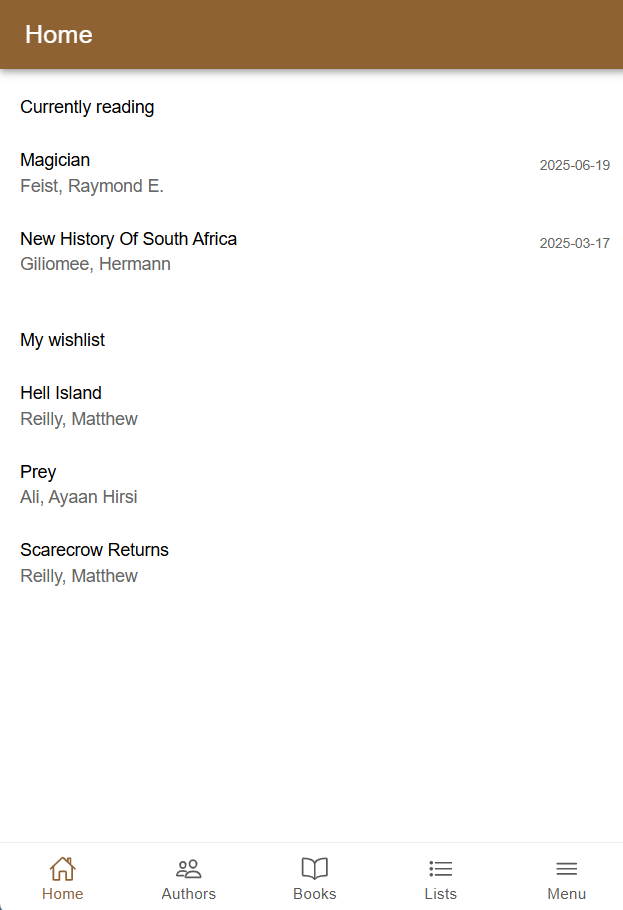
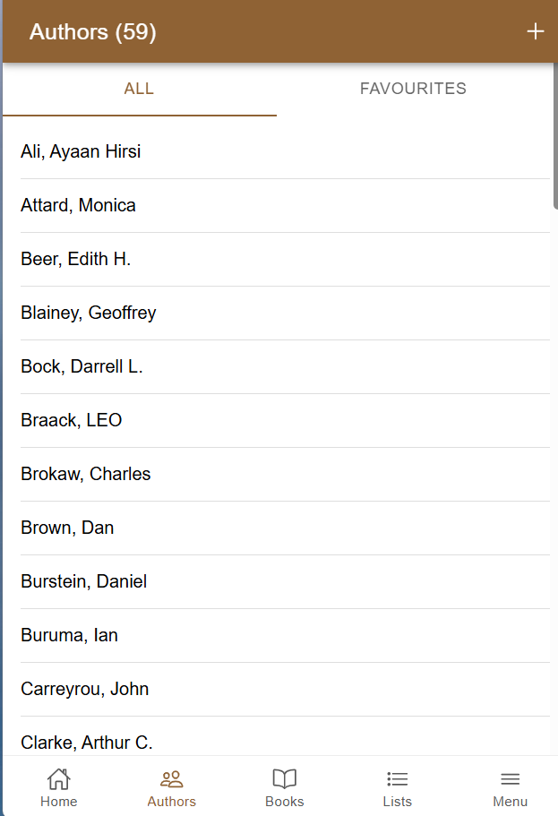
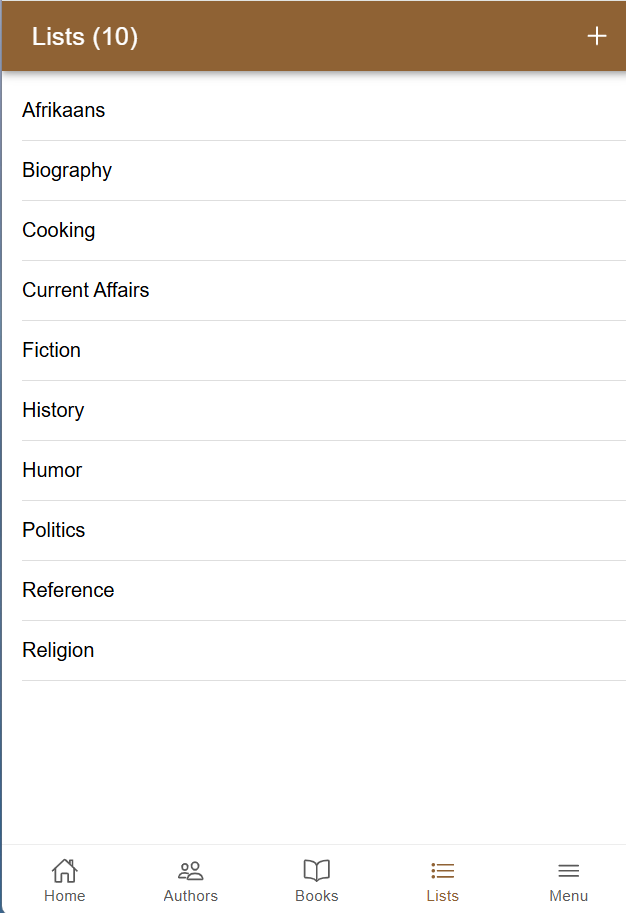
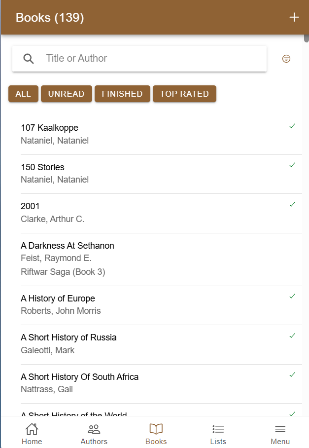

# BookApp

This is the first project I developed to manage my personal library of physical books.  
With BookApp, I keep track of the books I currently own, those I have owned before, and the ones I want to add to my collection. The app also helps me track which books I have read.

BookApp supports organizing books into series by authors, allows me to classify books using my own custom categories, and lets me add additional notes to each book for reference.

## Technology

BookApp is written in **StencilJs** with a mobile-first approach.  
Static assets are hosted on **Firebase**, which also provides the URL to access the app.  
Authentication is handled using **Firebase Auth**, while **Firestore Database** is used for data persistence and **Firebase Storage** for storing images.

Each user's data is stored securely so that only the respective user can access it.  
Locally, data is managed with **RxDB** and synchronized seamlessly with the Firestore Database.

## URL
https://fir-proj-5fc6c.web.app/

## Screenshots

